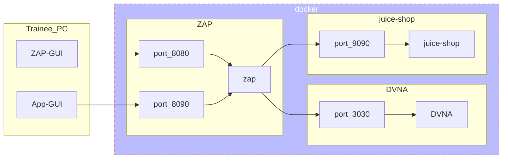

# supermaurio.github.io
## test
## test123

```mermaid
flowchart LR
    
    subgraph "Trainee_PC"
        ZAP-GUI
        App-GUI
    end
    subgraph "docker"
        subgraph "ZAP"
            port_8080-->zap
            port_8090-->zap
        end
        zap-->port_3030
        zap-->port_9090
        subgraph contdvna["DVNA"]
            port_3030 --> DVNA
        end
        subgraph jc["juice-shop"]
            port_9090 --> juice-shop
        end
    end
    ZAP-GUI --> port_8080
    App-GUI --> port_8090

    style docker fill:#bbf,stroke:#f66,color:#fff,stroke-dasharray: 5 5

```

